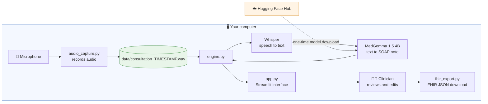
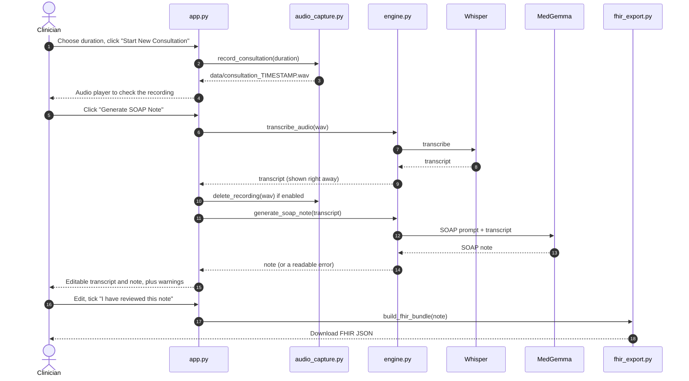
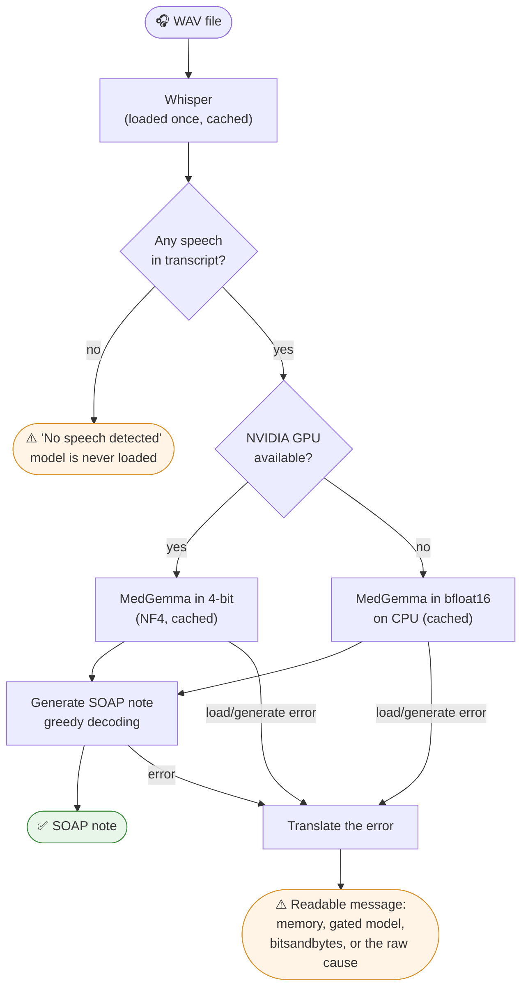
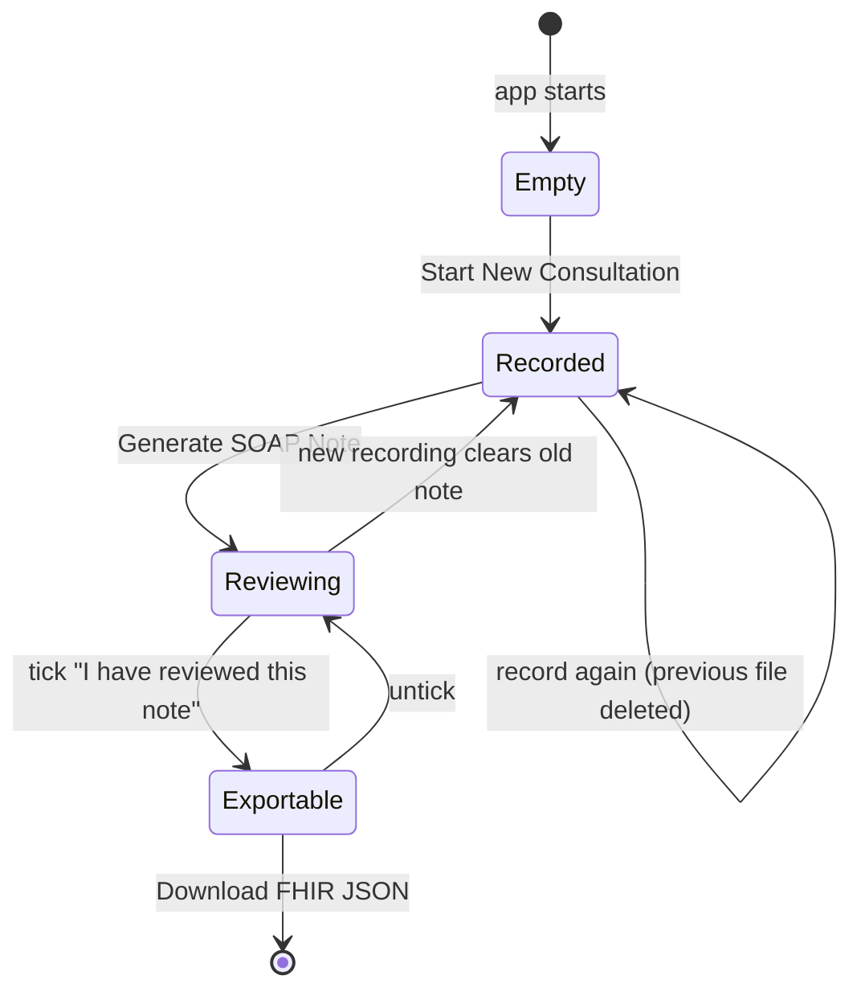
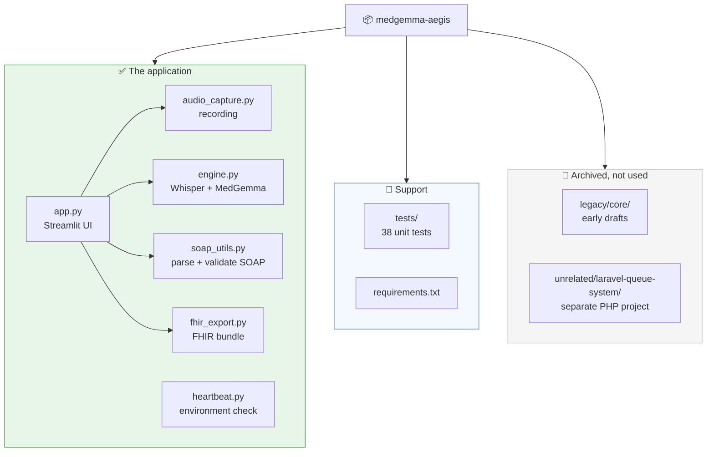
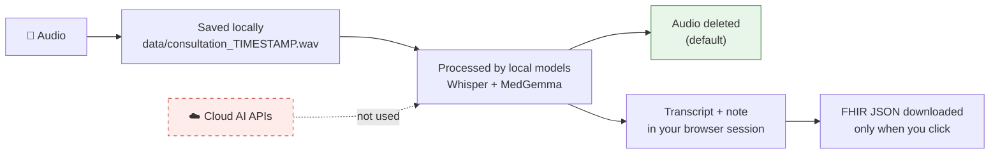

# 🛡️ AegisScribe

**A local-first clinical scribe: record a consultation, transcribe it with Whisper, and turn it into a structured SOAP note with Google's MedGemma. Review it, then export it as FHIR JSON. No cloud AI APIs involved.**

> ⚠️ **Prototype / research code.** AegisScribe is not a certified medical device. Every generated note must be reviewed and corrected by a qualified clinician before it goes anywhere near a patient record. See [Disclaimer](#-disclaimer).

---

## 📖 Table of contents

1. [What it does](#-what-it-does)
2. [Status at a glance](#-status-at-a-glance)
3. [How it works](#-how-it-works)
4. [Repository map](#-repository-map)
5. [Requirements](#-requirements)
6. [Installation](#-installation)
7. [Usage](#-usage)
8. [Configuration](#-configuration)
9. [Privacy and data handling](#-privacy-and-data-handling)
10. [Testing](#-testing)
11. [Troubleshooting](#-troubleshooting)
12. [Known limitations](#-known-limitations)
13. [Roadmap](#-roadmap)
14. [Disclaimer](#-disclaimer)

---

## 🎯 What it does

Writing clinical notes by hand takes time that clinicians would rather spend with patients. AegisScribe listens to a consultation and drafts the note for them.

| Step | What happens | Powered by |
|------|--------------|-----------|
| 1️⃣ **Record** | Captures audio from the microphone and saves it locally | `sounddevice` + `scipy` |
| 2️⃣ **Transcribe** | Converts speech to text | OpenAI Whisper (`tiny` by default, on CPU) |
| 3️⃣ **Structure** | Rewrites the transcript as **S**ubjective, **O**bjective, **A**ssessment, **P**lan, using only what was said | MedGemma 1.5 4B |
| 4️⃣ **Review** | Clinician reads and edits both texts; the app warns about missing SOAP sections | Streamlit |
| 5️⃣ **Export** | Downloads the reviewed note as a FHIR R4 document bundle | `fhir_export.py` |

The design goal is a tool that runs on modest hardware and keeps patient audio on the device.

---

## ✅ Status at a glance

| Feature | Status | Notes |
|---------|:------:|-------|
| Microphone recording | ✅ | 16-bit mono WAV, timestamped filename, clear error if no mic |
| Whisper transcription | ✅ | Model cached after first load; size configurable |
| MedGemma SOAP generation | ✅ | Cached; 4-bit on NVIDIA GPU, bfloat16 on CPU; real error messages |
| Missing-section warning | ✅ | Flags absent or empty S/O/A/P sections |
| Editable transcript and note | ✅ | Edits survive Streamlit reruns (kept for the session, not saved to disk) |
| Delete audio after transcribing | ✅ | On by default |
| FHIR JSON export | ✅ | Real FHIR R4 `Bundle`/`Composition`, status `preliminary`. **Not validated against a specific EHR** |
| Push to an EHR | ❌ | Download only |
| Automated tests | ✅ | 38 tests for the logic that doesn't need real models (see [Testing](#-testing)) |

---

## 🧭 How it works

### 1. Big picture

Everything runs inside one Streamlit process on your own machine.



The only network traffic is the **one-time model download**. After that the pipeline works offline.

### 2. A single consultation, step by step



### 3. Inside the AI pipeline (`engine.py`)



A few design choices worth knowing about:

- **The transcript is never lost.** If note generation fails, the transcript still appears and the real reason is shown.
- **The model is told not to invent things.** The prompt restricts it to the transcript and asks for "Not documented" when a section has no evidence. This reduces hallucination; it does not eliminate it.
- **Deterministic output.** Generation is greedy (no random sampling), so the same transcript gives the same note.
- **Windows-friendly.** Progress bars are switched off because they can crash Windows consoles (`WinError 6`).

### 4. UI state



---

## 🗂️ Repository map



```text
medgemma-aegis/
├── app.py                 # Streamlit front end (entry point)
├── audio_capture.py       # record_consultation(), delete_recording()
├── engine.py              # transcribe_audio(), generate_soap_note()
├── soap_utils.py          # parse_soap(), missing_sections()
├── fhir_export.py         # build_fhir_bundle(), to_json()
├── heartbeat.py           # Environment check (RAM, GPU, FFmpeg, mic, libraries)
├── requirements.txt       # Runtime dependencies
├── requirements-dev.txt   # Test dependencies (pytest, optional)
├── tests/                 # Unit tests
├── legacy/core/           # Early Whisper-only and distilgpt2 drafts (archived)
└── unrelated/
    └── laravel-queue-system/   # A separate Laravel/PHP project that was mixed into this repo
```

> **About `unrelated/laravel-queue-system/`:** these PHP files (queue tickets, officer dashboard, Laravel auth) have nothing to do with AegisScribe and can't run alone, because their routes, views and migrations are missing. They were moved here, not deleted. Consider giving them their own repository.

---

## 🔧 Requirements

### Hardware

| Component | Recommended | Notes |
|-----------|-------------|-------|
| GPU | NVIDIA with ~6 GB VRAM | Enables 4-bit MedGemma; much faster |
| RAM | 8 GB minimum | **CPU-only mode loads MedGemma unquantised and needs about 8–9 GB free** |
| Microphone | Any input device | Must be visible to `sounddevice` |
| Disk | A few GB free | For the Whisper and MedGemma model files |

### Software

- **Python 3.10 or newer**
- **[FFmpeg](https://ffmpeg.org/download.html)** on your `PATH` (Whisper needs it to read audio)
- A **Hugging Face account** with access to the MedGemma model. It is gated, so accept its terms on the model page first.

---

## 🚀 Installation

```bash
# 1. Get the code
git clone https://github.com/JoshuaOmosa/medgemma-aegis.git
cd medgemma-aegis

# 2. Create and activate a virtual environment
python -m venv .venv
source .venv/bin/activate          # Windows: .venv\Scripts\activate

# 3. Install PyTorch for your platform FIRST: https://pytorch.org/get-started/locally/
#    Then everything else:
pip install -r requirements.txt

# 4. Log in to Hugging Face so the gated MedGemma weights can download
huggingface-cli login

# 5. Check your setup
python heartbeat.py
```

`heartbeat.py` checks every requirement independently and tells you what is missing: library versions, RAM, CUDA GPU, FFmpeg, bitsandbytes, microphone and Whisper.

---

## ▶️ Usage

Run from the **repository root**:

```bash
streamlit run app.py
```

1. **Pick a duration** with the sidebar slider (5 to 60 seconds).
2. Optionally enter a **Patient ID** (used only in the FHIR export) and choose whether to **delete the audio** after transcription (on by default).
3. Click **🎤 Start New Consultation** and speak. An audio player appears so you can check the recording.
4. Click **🪄 Generate SOAP Note**. The first run is slow because the models load and download; later runs reuse them.
5. **Review** the transcript (left) and SOAP note (right) and correct anything wrong. A warning appears if a SOAP section is missing.
6. Tick **"I have reviewed and corrected this note"**, then click **💾 Download FHIR JSON**.

Test individual pieces:

```bash
python audio_capture.py     # records a 5-second test clip
python heartbeat.py         # checks your environment
```

---

## ⚙️ Configuration

Settings are environment variables, so no code edits are needed.

| Variable | Default | Purpose |
|----------|---------|---------|
| `AEGIS_WHISPER_MODEL` | `tiny` | Whisper size: `tiny`, `base`, `small`, ... (bigger is more accurate, slower, more RAM) |
| `AEGIS_LANGUAGE` | auto-detect | Force a language code such as `en` or `sw` |
| `AEGIS_WHISPER_PROMPT` | none | Optional Whisper hint text (can cause made-up text on silent audio, so it is off by default) |
| `AEGIS_LLM_ID` | `google/medgemma-1.5-4b-it` | Hugging Face model id |
| `AEGIS_MAX_NEW_TOKENS` | `512` | Maximum note length |
| `AEGIS_TRUST_REMOTE_CODE` | `0` | Set to `1` only if your model revision requires custom code from the Hub |

```bash
# macOS / Linux
export AEGIS_WHISPER_MODEL=base
# Windows PowerShell
$env:AEGIS_WHISPER_MODEL = "base"
# Windows cmd
set AEGIS_WHISPER_MODEL=base
```

Other tweakable values (recording sample rate, data folder) live at the top of `audio_capture.py`.

---

## 🔒 Privacy and data handling



**What the code does**

- Audio, transcription and note generation all run on your machine. No patient data is sent to an external AI service.
- Recordings go to `data/` (git-ignored). They are deleted right after a successful transcription unless you untick the option. If you untick it, **you** are responsible for cleaning up `data/`.
- Filenames contain only a timestamp, never patient details.
- The FHIR export contains the Patient ID **only if you type one**, and the transcript **only if you tick the option**.
- Custom model code from the Hugging Face Hub is **not** executed by default.

**What you still need to handle yourself**

- Recordings are **not encrypted** while they exist on disk.
- There is no login, audit log or access control on the Streamlit app. Do not expose it on a network without authentication and HTTPS.
- The transcript and note live in browser-session memory; closing the tab discards them.
- Real patient data is regulated (HIPAA, GDPR, the Kenya Data Protection Act, and similar). Get the appropriate review before any clinical use.

---

## 🧪 Testing

```bash
python -m unittest discover -s tests -t .      # no extra installs needed
# or, with pytest installed:
pytest
```

**What the 38 tests cover:** SOAP parsing across heading styles, FHIR bundle structure, escaping and references, the engine's logic (prompt, greedy decoding, empty-transcript guard, error translation, caching) using stand-in models, and audio saving/deleting using a fake microphone.

**What they do not cover:** they never download or run the real Whisper or MedGemma models, use a real microphone, or drive a real Streamlit server. Before relying on the app, run `python heartbeat.py` and do one real end-to-end consultation on your own hardware. The FHIR output has also not been checked with an official FHIR validator.

---

## 🩺 Troubleshooting

| Symptom | Likely cause and fix |
|---------|----------------------|
| "Could not access the microphone" | No input device, wrong default device, or OS permission denied. Run `python audio_capture.py` to isolate it |
| "Not enough memory to run MedGemma" | Close other apps, or use a machine with a GPU or more RAM. CPU mode needs about 8–9 GB free |
| "It is a gated model ... huggingface-cli login" | Accept the model terms on Hugging Face, then log in |
| "4-bit loading failed (bitsandbytes)" | Needs a supported NVIDIA GPU and matching CUDA. Not available on macOS |
| Model loading complains about custom code | Try `AEGIS_TRUST_REMOTE_CODE=1` (only if you trust the model repo) |
| "No speech was detected" | Mic muted or too quiet; record again closer to the microphone |
| Whisper errors about `ffmpeg` | Install FFmpeg and make sure it is on your `PATH` |
| First "Generate" takes minutes | Normal: models are loading/downloading. Later runs are faster |

---

## 🧱 Known limitations

1. **Whisper `tiny` is fast but error-prone**, especially with drug names and clinical terms. Those errors flow into the note. Try `AEGIS_WHISPER_MODEL=base` or `small`.
2. **Whisper can produce text from near-silence.** The "no speech" guard only catches a fully empty transcript, so always read the transcript.
3. **CPU-only mode is heavy.** Without a GPU, MedGemma runs unquantised and needs about 8–9 GB free RAM, so 8 GB machines may not cope.
4. **Recording blocks the UI** for the chosen duration and cannot be stopped early.
5. **Edits live only in the browser session.** They survive reruns but are not saved to disk.
6. **Hallucination is reduced, not solved.** The prompt limits the model to the transcript and the app flags missing sections, but nothing checks each statement against the transcript.
7. **FHIR export is a download, not an integration**, and is unvalidated against specific EHR profiles.
8. **No authentication or encryption** (see [Privacy](#-privacy-and-data-handling)).
9. **No licence file yet.** Add one before sharing or accepting contributions.

---

## 🗺️ Roadmap

**Done**

- [x] `requirements.txt`
- [x] Cache models so they load once
- [x] Real FHIR R4 export (download)
- [x] Fix greedy vs. sampling; report real error messages
- [x] CPU fallback for machines without a CUDA GPU
- [x] Timestamped recordings; optional audio deletion
- [x] Persist edits across reruns; warn about missing SOAP sections
- [x] Restrict the prompt to the transcript
- [x] Automated tests; archive unused and unrelated code

**Next**

- [ ] Validate the FHIR bundle and connect to an EHR sandbox
- [ ] Stop button and live status while recording
- [ ] Save reviewed notes to disk (encrypted)
- [ ] Check each note statement against the transcript
- [ ] Compare Whisper sizes on real clinic audio
- [ ] Authentication for the web app
- [ ] Choose and add a licence

---

## ⚕️ Disclaimer

AegisScribe is an experimental prototype for research and education. It is **not** a medical device, has not been clinically validated, and does not provide medical advice or diagnoses. AI-generated notes can be incomplete, wrong or misleading. A licensed clinician must review every output before it is used for patient care or stored in a health record. Use with real patient data only after proper legal, privacy and clinical-safety review.

---

## 🙏 Acknowledgements

- [MedGemma](https://github.com/Google-Health/medgemma) by Google Health AI Developer Foundations
- [Whisper](https://github.com/openai/whisper) by OpenAI
- [Streamlit](https://streamlit.io/), [Hugging Face Transformers](https://github.com/huggingface/transformers), [PyTorch](https://pytorch.org/)
